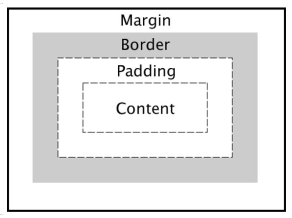

#Lecture review Questions
**Question 1 Solution**
Props are data react uses that behaves in a similar way to paramaters in pure javascript. They are passed to the items that need them to function in a particular way. The state is the collection of the items stored in the component, behaving like a class with a number of fields to store items.

###Props example

const Profile = (props) => { return (

<h1>{props.title}</h1>

 );
}

###State example

class Profile extends React.Component {
constructor(props){
super(props)
this.state = {"show_technologies": false}
this.see_our_technologies = this.see_our_technologies.bind(this);
}

**Question 2 Solution**
The term "functor" refers to the collection of different types of objects, from int to strings. These items can be mapped from and copies of the same values can be passed into different methods themselves.

###JS Example
['123', '456', '789'].map(s => parseInt(s)).map(n => n / 10)

**Question 3 Solution**
###Callbacks
Advantage:

> Ensures the application the continue interacting with the user within the application while retrieving the requested file

Disadvatange:

> If there is a necessity of further callbacks dependent on the intial one, the layout can quickly become unefficient and highly coupled, which is unrelibale in a timing application

###Promises
Advantage:

> Allows the applciation to be decoupled while ensuring a result is returned indicating the success of the contract of the agreement between the application and the associated api. This is by storing the promise within a variable itself.

Disadvatange:

> When the promise is returned, the application i/o and performance is interupted to handle the promise request

###Streams
Advantage:

> Streams allows data to be processed on once retrieved from any source which the stream decided to get the source from, without the client needing to working about it

Disadvatange:

> The data returned could be processed in an unexpected way which the application would not know what to do, making debugging and maintence difficult to do with streams

**Question 4 Solution**
With the aid of a diagram and example code, describe the Cascading Style Sheets (CSS) Box Model and show how it can be used to space DOM elements

The CSS box model describes the layout which we can use to place spacing between certain dom elements. It captures the details in a box format. The elements, from the most exterior side, can be described as margin, bording, padding and content. The margin separates the element from other elements in the exterior way. The border describes the external layout which separates from other dom elements. The padding separates the content of the dom element from the border itself and the content is the elements which is to be displayed to the user themselve.

###CSS box model example
div {
width: 320px;
padding: 10px;
border: 5px solid gray;
margin: 0;
}

**Question 5 Solution**
When the url is reached through an http request, the application will start loading the assets that is needed from the server onto the browser engine. The assets are a combiantion of HTML5, CSS3, JavaScript libraries and other multimedia needed. As each file is loaded, the engine parses the file and completes the immediate tasks required of the applications, such as fetching other resources needed in the immediate future. After running the necessary commands, the application is built using the provided tools, such as how the html decides the view would look like combined with the styling instructions from the css files. The process of fetching, building and styling repeats until all the files needed have been fetched.
